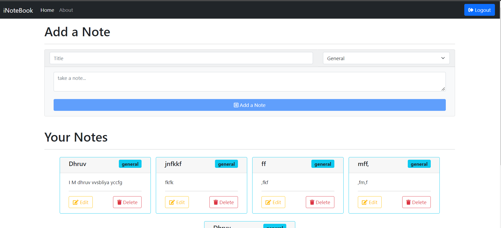

# iNoteBooker

• iNoteBooker is a To‑Do Application. UI is designed using React and Backend is implemented in NodeJS, ExpressJS ,MongoDB
and various node packages.
• It allows you to create ,update ,edit and delete notes w.r.t. user personal account, and save securely at cloud.
• User validation and session management established via middlewares using JWT‑Authorization and User Credentials Secured
using BcryptJS.
• Database live at MongoDB Atlas and Web application deployed at Heroku.

